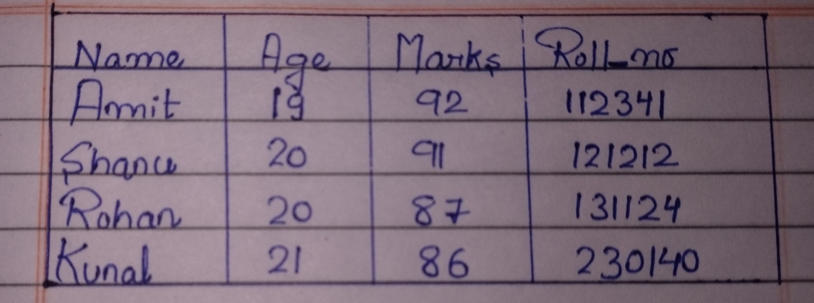
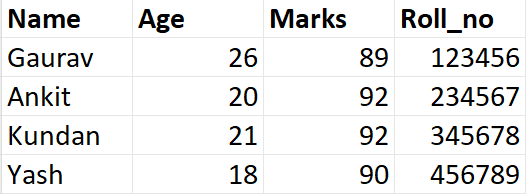
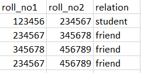
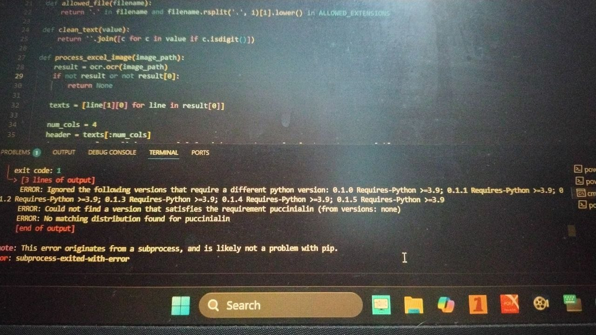

<div align="center">

# ❀ DocuQuery-AI ❀

### AI-Powered Intelligent Document Processing and Information Retrieval System

*Transforming scanned documents into structured, searchable knowledge using Optical Character Recognition, intelligent table extraction, and MongoDB.*

---

**Developed by Ankit Kumar Thakur**

B.Tech Information Technology Engineering  
Maharaja Agrasen Institute of Technology, Delhi

</div>

---

# ❀ Overview

DocuQuery-AI is an intelligent document processing system designed to automate the extraction, organization, storage, and retrieval of information from scanned documents.

Traditional document management systems often require manual data entry, making them time-consuming, error-prone, and difficult to scale. DocuQuery-AI addresses this challenge by integrating Optical Character Recognition (OCR), document preprocessing, intelligent table extraction, structured database storage, and keyword-based information retrieval into a unified web application.

The project demonstrates an end-to-end document intelligence pipeline capable of processing printed and handwritten documents while significantly reducing manual effort involved in digitization.

---

# ❀ Motivation

Every organization generates thousands of documents ranging from reports and invoices to handwritten forms and tabular records. Although these documents contain valuable information, much of it remains inaccessible because it exists only as scanned images or PDFs.

The motivation behind DocuQuery-AI is to bridge the gap between physical documents and searchable digital knowledge by developing a system capable of:

- Extracting textual information from scanned documents.
- Preserving tabular structures during extraction.
- Organizing extracted information into structured formats.
- Storing the extracted data efficiently.
- Allowing users to retrieve information instantly through keyword-based search.

---

# ❀ Key Features

- Intelligent OCR using PaddleOCR
- Printed and handwritten document processing
- Automatic table extraction
- Image preprocessing for improved recognition
- MongoDB integration for structured document storage
- Keyword-based document retrieval
- Flask-based interactive web interface
- Modular and extensible architecture
- Support for image and scanned document processing
- Structured JSON generation from extracted data

---

# ❀ OCR Technologies

The core OCR pipeline of DocuQuery-AI is built around **PaddleOCR**, an industrial-grade Optical Character Recognition framework developed by Baidu.

PaddleOCR was selected because it provides:

- High text recognition accuracy
- Fast inference speed
- Robust multilingual support
- Excellent document layout understanding
- Reliable table recognition capabilities
- Lightweight deployment

Within this project, PaddleOCR performs:

- Text region detection
- Character recognition
- Text orientation correction
- Table content extraction
- Structured document understanding

Image preprocessing is carried out using **OpenCV**, improving document readability before OCR inference.

The extracted information is then cleaned, structured, and converted into JSON before being stored inside MongoDB.

---

# ❀ OCR Research Background

During the development and research phase, multiple OCR methodologies were explored to understand their strengths, limitations, and suitability for intelligent document processing.

These include:

- PaddleOCR
- Microsoft TrOCR
- DocTR (Document Text Recognition)
- Traditional OCR pipelines

The current implementation uses PaddleOCR as the primary OCR engine due to its balance of accuracy, inference speed, and structured document support. However, the modular design allows future benchmarking and integration of transformer-based OCR models such as TrOCR and DocTR.

---

# ❀ Technology Stack

| Technology | Purpose |
|------------|---------|
| Python | Backend Development |
| Flask | Web Framework |
| PaddleOCR | Optical Character Recognition |
| OpenCV | Image Processing |
| MongoDB | NoSQL Database |
| PyMongo | MongoDB Integration |
| NumPy | Numerical Computing |
| Pandas | Data Processing |
| HTML | User Interface |
| CSS | Styling |
| JavaScript | Client-side Interaction |

---

# ❀ System Workflow

```
Document Upload
        │
        ▼
Image Preprocessing
        │
        ▼
PaddleOCR
(Text Detection + Recognition)
        │
        ▼
Table Extraction
        │
        ▼
Data Cleaning
        │
        ▼
JSON Structuring
        │
        ▼
MongoDB Storage
        │
        ▼
Keyword-Based Retrieval
        │
        ▼
Relevant Search Results
```

---

# ❀ Project Architecture

```
                User Uploads Document
                         │
                         ▼
                  Flask Application
                         │
                         ▼
                  Image Processing
                     (OpenCV)
                         │
                         ▼
                     PaddleOCR
                         │
                         ▼
             Text & Table Extraction
                         │
                         ▼
               Structured JSON Output
                         │
                         ▼
                    MongoDB Database
                         │
                         ▼
               Keyword Query Engine
                         │
                         ▼
              Search Results Display
```

---

# ❀ Sample Input Documents

The repository includes several representative documents used during development and testing.

These include:

- Printed tabular documents
- Handwritten tables
- Online handwritten samples
- Relation diagrams
- Sample records
- OCR benchmark images

These files are available in the **sample_inputs** directory.

---

# ❀ Project Demonstration

### Complete Project Walkthrough

https://youtu.be/SPeeEQ1_nGs

---

### OCR + MongoDB Integration

https://youtu.be/RJs8wNMsJdI

---

### Keyword Retrieval Demonstration

https://youtu.be/8cvjR7TyJb0

---

# ❀ Project Gallery

## Input Document



---

## OCR Extraction


---

## Sample Table Image



---

## Relation TABLE SCHEMA



---

## Application Screenshot




---

# ❀ Installation

Clone the repository

```bash
git clone https://github.com/YOUR_USERNAME/DocuQuery-AI.git
```

Move into the project directory

```bash
cd DocuQuery-AI
```

Create a virtual environment

```bash
conda create -n docuquery python=3.10
```

Activate the environment

```bash
conda activate docuquery
```

Install dependencies

```bash
pip install -r requirements.txt
```

Run the application

```bash
python app.py
```

---

# ❀ Project Structure

```
DocuQuery-AI
│
├── modules/
│   ├── hand_only_query.py
│   ├── knowledgegraph.py
│   ├── mongo_knowledgegraph.py
│   ├── mongosetup.py
│   ├── paddlemongo.py
│   └── queryextractor.py
│
├── sample_inputs/
│
├── static/
│
├── templates/
│
├── uploads/
│
├── app.py
├── requirements.txt
├── Procfile
└── README.md
```

---

# ❀ Applications

DocuQuery-AI can be applied across multiple domains, including:

- Government record digitization
- Defence documentation
- Healthcare records
- Financial document management
- Educational archives
- Enterprise document management
- Legal documentation
- Research data organization

---

# ❀ Future Research Directions

The modular architecture of DocuQuery-AI allows future expansion in several directions.

Potential enhancements include:

- Retrieval-Augmented Generation (RAG)
- Semantic document search
- Knowledge Graph construction
- Named Entity Recognition
- Vector database integration
- Transformer-based OCR benchmarking
- Multilingual document understanding
- Large Language Model integration
- Cloud-native deployment
- Automatic document classification

---

# ❀ Author

**Ankit Kumar Thakur**

B.Tech Information Technology Engineering

Maharaja Agrasen Institute of Technology, Delhi

**Areas of Interest**

- Artificial Intelligence
- Machine Learning
- Computer Vision
- Document Intelligence
- OCR Systems
- Deep Learning
- Generative AI
- Research & Development

GitHub: **https://github.com/NeuralImprint**

LinkedIn: **https://www.linkedin.com/in/ankit-thakur-179a23237/**

---

## ❀ License

Copyright © 2026 Ankit Kumar Thakur.

This project is protected under a custom **All Rights Reserved** license.

The source code is provided for portfolio demonstration, academic reference,
and research purposes only.

No part of this repository may be copied, modified, redistributed,
or used in any form without prior written permission from the author.

---

<div align="center">

### ❀ If you found this project helpful, consider giving it a Star. ❀

</div>